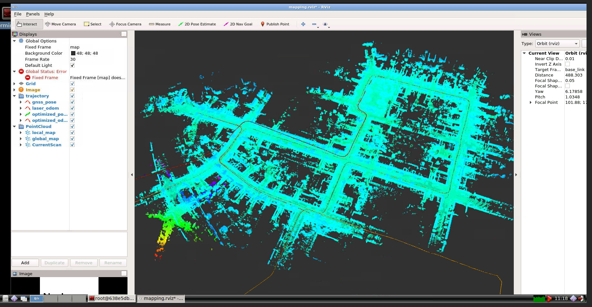
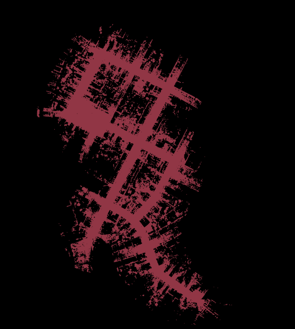
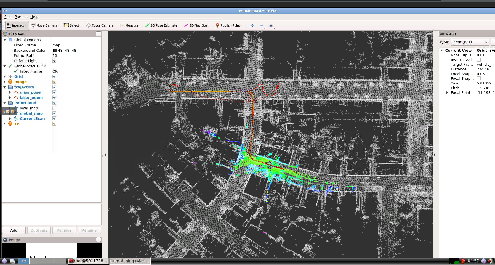
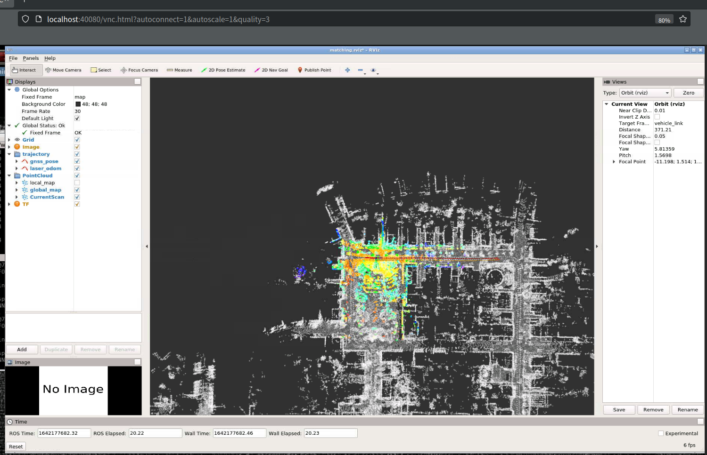
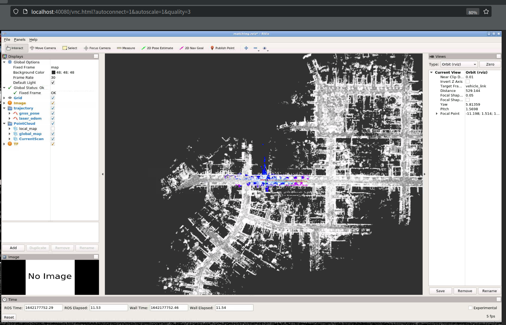

* 第四章作业
  
  Step.1 编译运行程序，播放bag包，然后运行bash mapping.sh，即可保存地图。




由于笔记本内存较小，可以分包
```bash
rosbag filter kitti_lidar_only_2011_10_03_drive_0027_synced.bag output.bag "t.to_sec() >= 1317646534.478375 and t.to_sec() <= 1317646734.478375"
```




Step.2 实现初始全局定位

 执行 bash matching.sh，效果如下图：




Step.3 实现任意时间全局定位

修改matching_flow.cpp, 
```c++
bool MatchingFlow::UpdateMatching() {
    if (!matching_ptr_->HasInited()) {
        // 利用GPS点进行初始化
        matching_ptr_->SetGNSSPose(current_gnss_data_.pose);
    }

    return matching_ptr_->Update(current_cloud_data_, laser_odometry_);
}
```

gnss_data.cpp


rosbag play -s 100 output.bag

效果如下：


rosbag play -s 150 output.bag

效果如下：

