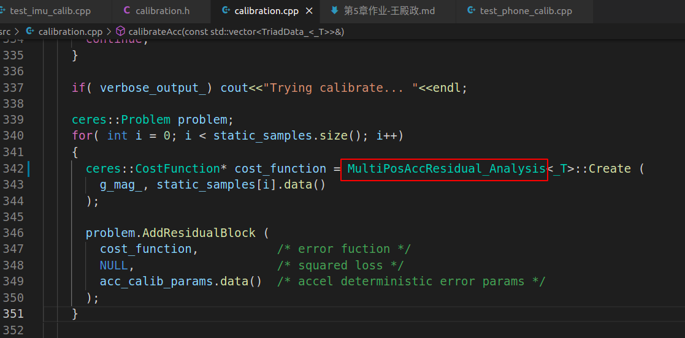
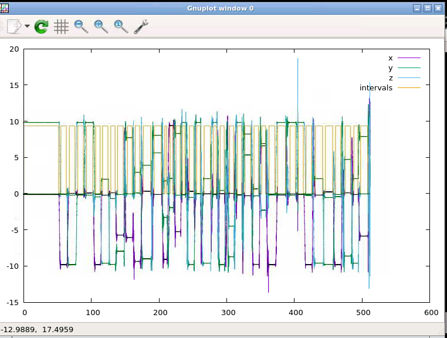
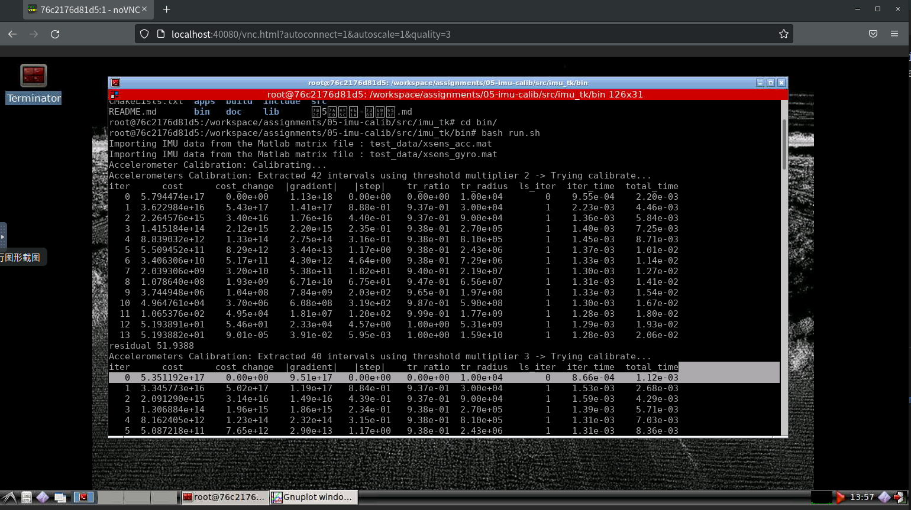
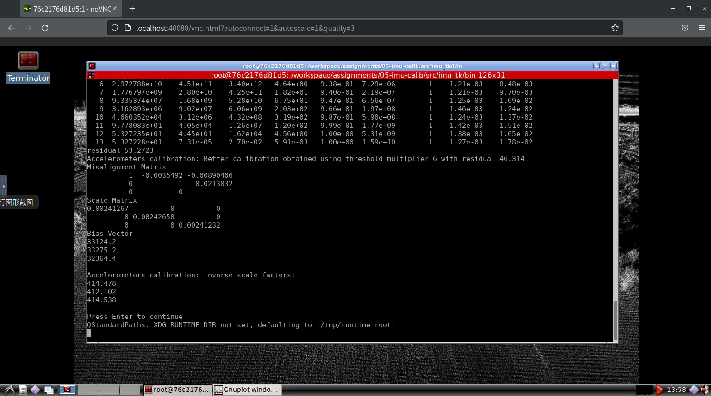

# 第五章作业关键步骤

## Step.1 删除原来的自动求导，增加解析求导类  
class MultiPosAccResidual_Analysis，见calibration.cpp 113行  
关键代码  
```c++

Eigen::MatrixXd a(3, 1);
// 加速度       
a << K1*(A1-b1), -S1*K1*(A1-b1)+K2*(A2-b2), -S2*K1*(A1-b1)-S3*K2*(A2-b2)+K3*(A3-b3);

Eigen::MatrixXd da_dTheta(3, 9);
// 加速度求导
da_dTheta << 0, 0, 0, A1-b1, 0, 0, -K1, 0, 0, -K1*(A1-b1), 0, 0, -S1*(A1-b1), A2-b2, 0, S1*K1, -K2, 0, 0, -K1*(A1-b1), -K2*(A2-b2), -S2*(A1-b1), -S3*(A2-b2), A3-b3, S2*K1, S3*K2, -K3;

Eigen::Map<Eigen::Matrix<double, 1, 9, Eigen::RowMajor> > Jacob(jacobians[0]);
Jacob.setZero();
//求解结果设置雅克比
Jacob = - 2 * calib_samp.transpose() * da_dTheta;
```


## Step.2 实现下三角模型  

```C++

//
// TODO: implement lower triad model here
//
acc_calib_params[0] = init_acc_calib_.misYZ();
acc_calib_params[1] = init_acc_calib_.misZY();
acc_calib_params[2] = init_acc_calib_.misZX();

acc_calib_params[3] = init_acc_calib_.scaleX();
acc_calib_params[4] = init_acc_calib_.scaleY();
acc_calib_params[5] = init_acc_calib_.scaleZ();

acc_calib_params[6] = init_acc_calib_.biasX();
acc_calib_params[7] = init_acc_calib_.biasY();
acc_calib_params[8] = init_acc_calib_.biasZ();
    
```

需要相应的修改正负号 calibration.h
``` C++
inline _T misYZ() const { return -mis_mat_(0,1); };
inline _T misZY() const { return -mis_mat_(0,2); };   //正变负
inline _T misZX() const { return -mis_mat_(1,2); };
inline _T misXZ() const { return -mis_mat_(1,0); };   //正变负
inline _T misXY() const { return -mis_mat_(2,0); };
inline _T misYX() const { return -mis_mat_(2,1); };   //正变负

  ```

## Step.3 使用Ceres调用构建的解析解  

 


## 运行效果如下：  

 
 
 