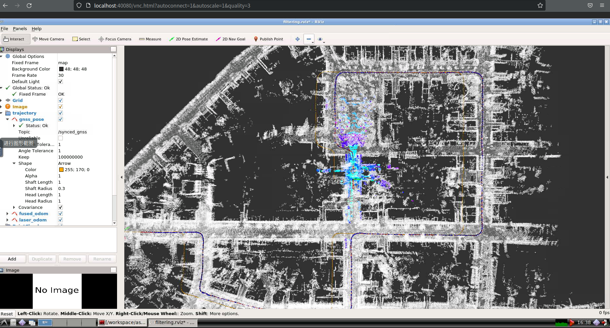
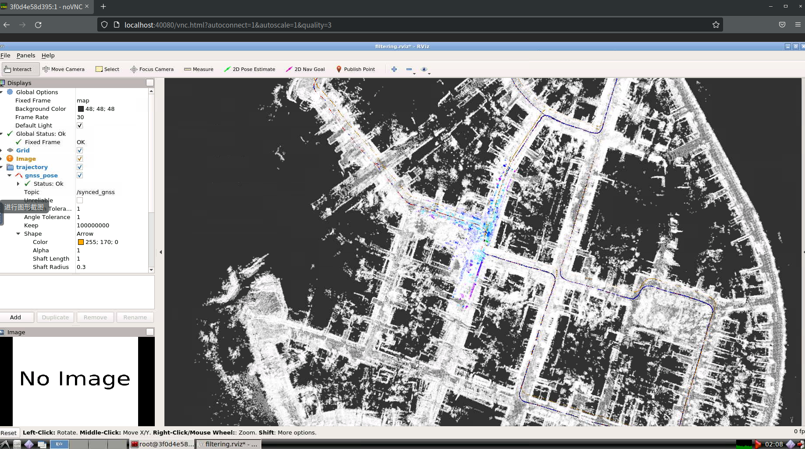
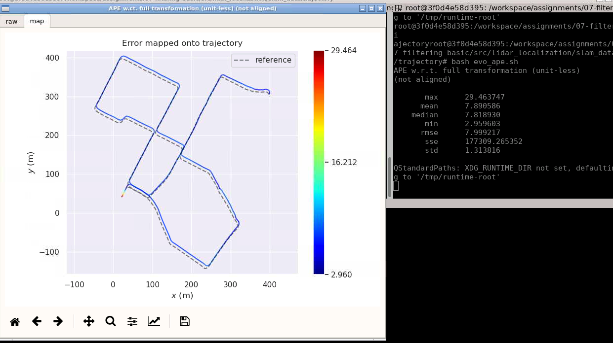
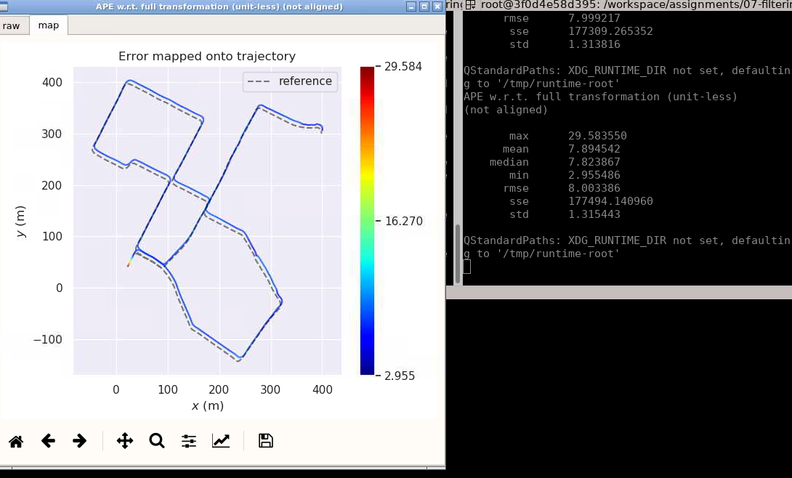
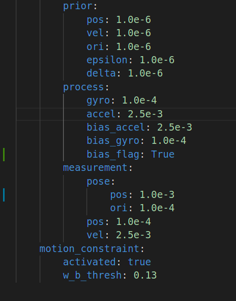
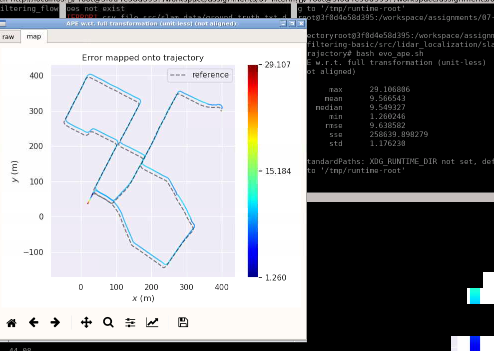
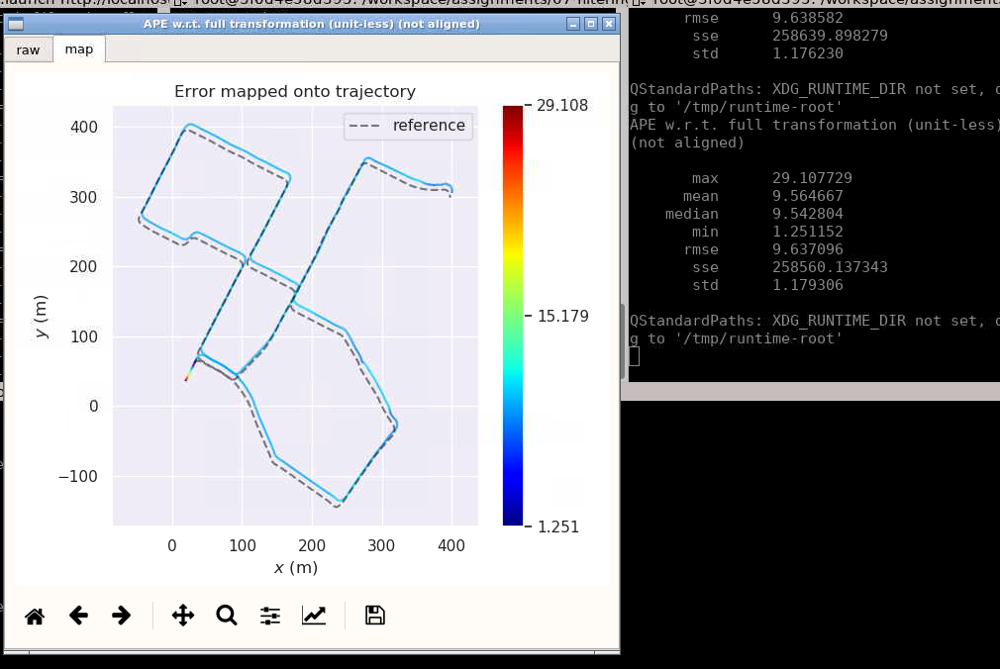
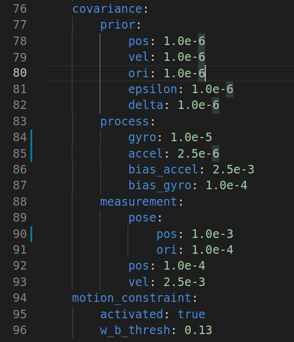
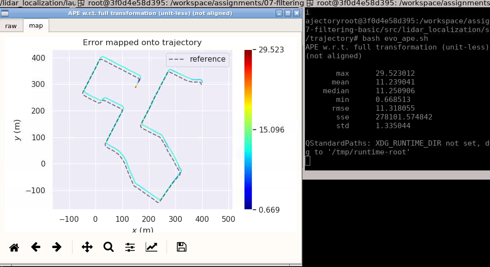
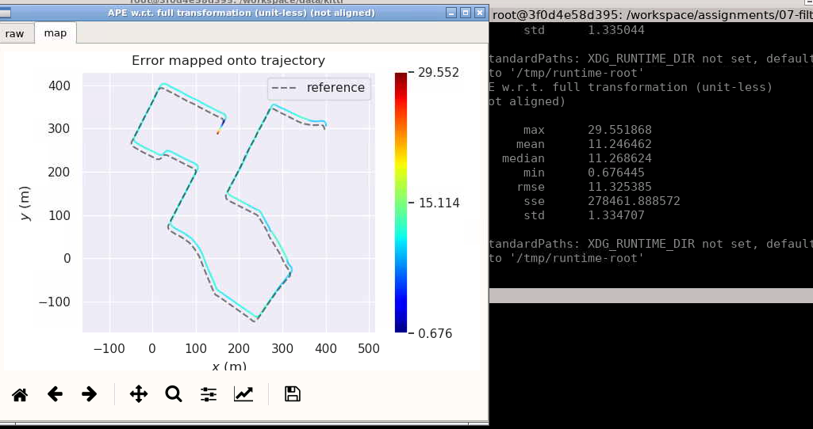

# 07-filtering-basic

## 修改error_state_kalman_filter.cpp

播放bag包，效果如下






执行下面命令
```bash
# a. laser:
evo_ape kitti ground_truth.txt laser.txt -r full --plot --plot_mode xy
```
查看laser误差如下



执行下面命令
```bash
# b. fused:
evo_ape kitti ground_truth.txt fused.txt -r full --plot --plot_mode xy
```
查看融合误差如下


修改参数文件，即可获得不同参数下的运行效果

### 第二组参数



运行效果





## 不考虑随机游走模型
主要修改的地方如下：
```c++
void ErrorStateKalmanFilter::EliminateError(void) {
  //
  // TODO: correct state estimation using the state of ESKF
  //

    // a. position:
  pose_.block<3, 1>(0, 3) =
          pose_.block<3, 1>(0, 3) - X_.block<3,1>(INDEX_ERROR_POS, 0); // fix this
  // b. velocity:
  vel_ = vel_ - X_.block<3,1>(INDEX_ERROR_VEL, 0);                     // fix this
  // c. orientation:
  Eigen::Matrix3d R_nn =
      Sophus::SO3d::hat(X_.block<3, 1>(INDEX_ERROR_ORI, 0)).matrix();
  pose_.block<3, 3>(0, 0) = pose_.block<3, 3>(0, 0) * (Eigen::MatrixXd::Identity(3,3) - R_nn); // fix this

  // // d. gyro bias:
  // if (IsCovStable(kIndexErrorGyro)) {
  //   gyro_bias_ += X_.block<3, 1>(kIndexErrorGyro, 0);
  // }

  // // e. accel bias:
  // if (IsCovStable(kIndexErrorAccel)) {
  //   accl_bias_ += X_.block<3, 1>(kIndexErrorAccel, 0);
  // }
}

```

### 第一组参数








