# 08-filtering-advanced

# 运行模型

Step.1 将第七章的滤波功能添加到error_state_kalman_filter.cpp中，此处不赘述

编译并且启动node
```bash
# build:
catkin config --install && catkin build
# set up session:
source install/setup.bash
# launch:
roslaunch lidar_localization kitti_localization.launch
```

播放bag包
rosbag play output.bag
,  运行下面命令，即可保存轨迹到slam_data/trajacty 目录下
```bash
# set up session:
source install/setup.bash
# save odometry:
rosservice call /save_odometry "{}"
```
在保存的轨迹txt文件夹中，运行下面命令
```
# run evo evaluation:
# a. laser:
evo_ape kitti ground_truth.txt laser.txt -r full --plot --plot_mode xy
# b. fused:
evo_ape kitti ground_truth.txt fused.txt -r full --plot --plot_mode xy
```

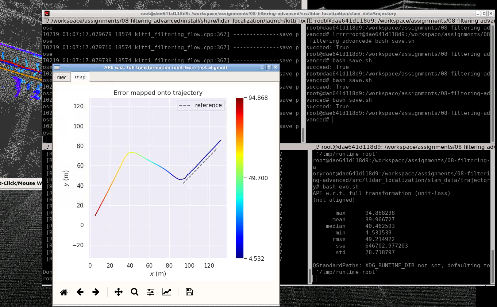


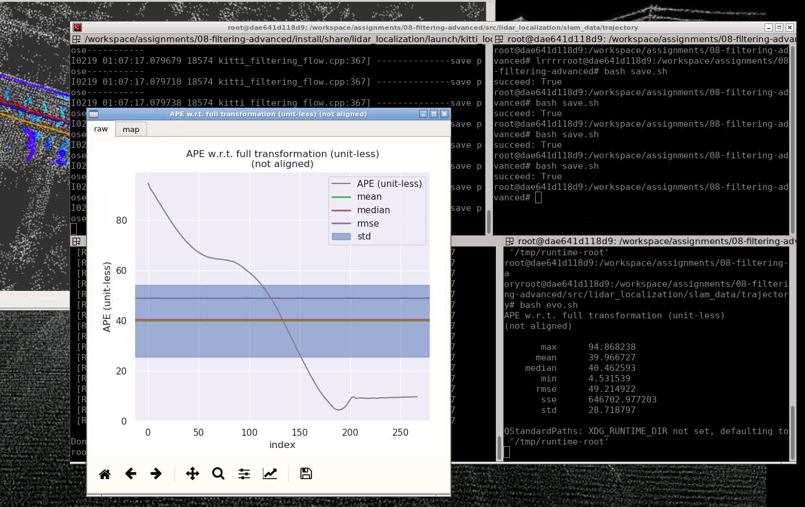

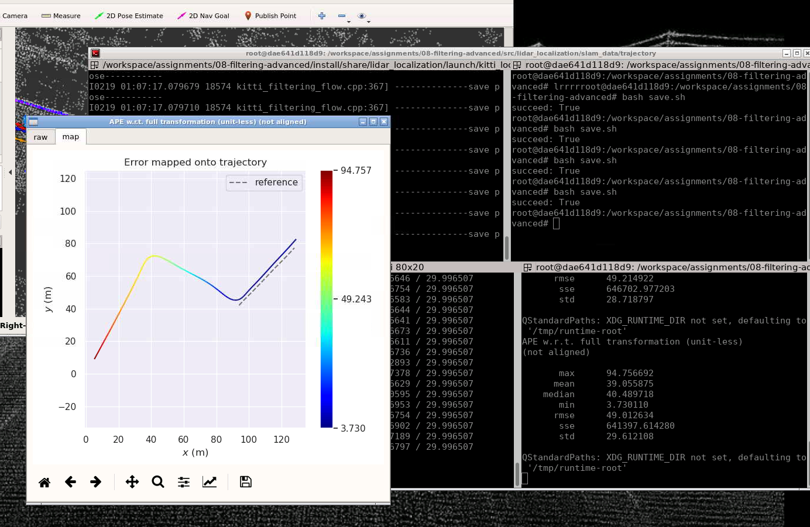

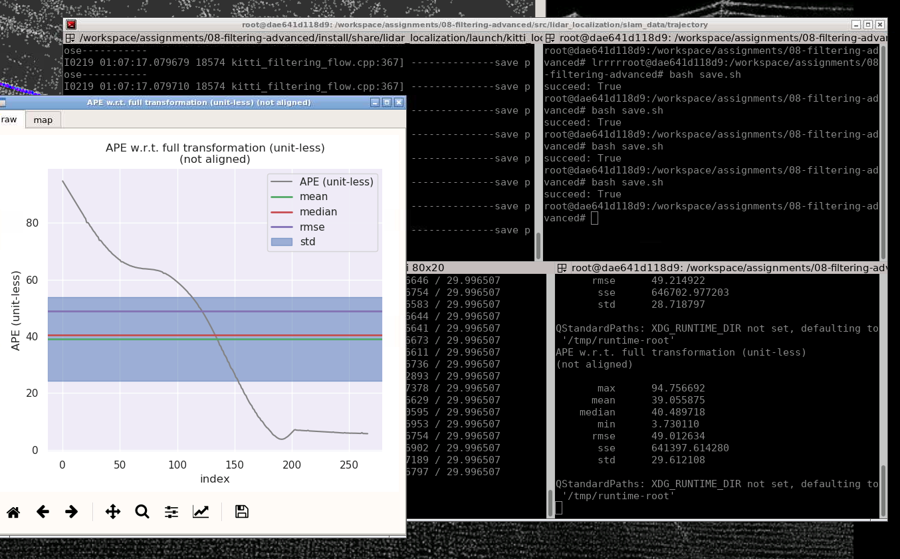


Step.2 添加运动约束  
首先增加修正逻辑，如下：  
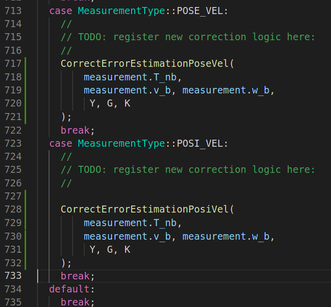

然后需要具体实现相应函数，完成TODO  

```C++
void ErrorStateKalmanFilter::CorrectErrorEstimationPoseVel(
    const Eigen::Matrix4d &T_nb, const Eigen::Vector3d &v_b, const Eigen::Vector3d &w_b,
    Eigen::VectorXd &Y, Eigen::MatrixXd &G, Eigen::MatrixXd &K
) {
    //
    // TODO: set measurement:
    //
    Eigen::Vector3d  v_b_  =  v_b;           
    Eigen::Vector3d  dp  =  pose_.block<3,  1>(0,  3)  -   T_nb.block<3,  1>(0,  3);
    Eigen::Matrix3d  dR  =  T_nb.block<3,  3>(0, 0).transpose() *  pose_.block<3, 3>(0, 0) ;
    Eigen::Vector3d  dv  =   T_nb.block<3,  3>(0, 0).transpose() *vel_  -  v_b_ ;                  
    // TODO: set measurement equation:
    Eigen::Vector3d  dtheta  =  Sophus::SO3d::vee(dR  -  Eigen::Matrix3d::Identity() );
    YPoseVel_.block<3, 1>(0, 0)  =  dp;          //    delta  position 
    YPoseVel_.block<3, 1>(3, 0)  =  dv;           //   delta   velocity  s
    YPoseVel_.block<3, 1>(6, 0)  =  dtheta;          //   失准角
    Y = YPoseVel_;
    //   set measurement  G
    GPoseVel_.setZero();
    GPoseVel_.block<3, 3>(0, kIndexErrorPos)  =  Eigen::Matrix3d::Identity();
    GPoseVel_.block<3, 3>(3, kIndexErrorVel)   =   T_nb.block<3,  3>(0, 0).transpose();
    GPoseVel_.block<3, 3>(3, kIndexErrorOri)   =   Sophus::SO3d::hat( T_nb.block<3,  3>(0, 0).transpose() *vel_  ) ;
    GPoseVel_.block<3 ,3>(6, kIndexErrorOri)   =  Eigen::Matrix3d::Identity();        
    G  =   GPoseVel_;     
    //   set measurement  C
    CPoseVel_.setIdentity();
    Eigen::MatrixXd  C  =   CPoseVel_;
    // TODO: set Kalman gain:
    Eigen::MatrixXd R = RPoseVel_;    //  观测噪声
    K =  P_  *  G.transpose() * ( G  *  P_  *  G.transpose( )  +  C * RPoseVel_*  C.transpose() ).inverse() ;

}
```


以及CorrectErrorEstimationPosiVel函数
```C++
void ErrorStateKalmanFilter::CorrectErrorEstimationPosiVel(
    const Eigen::Matrix4d &T_nb, const Eigen::Vector3d &v_b, const Eigen::Vector3d &w_b,
    Eigen::VectorXd &Y, Eigen::MatrixXd &G, Eigen::MatrixXd &K
) {
    // parse measurement:

    // set measurement equation:

    // set Kalman gain:

    Eigen::Vector3d  v_b_  =  {v_b[0],  0,  0};           
    Eigen::Vector3d  dp  =  pose_.block<3,  1>(0,  3)  -   T_nb.block<3,  1>(0,  3);
    Eigen::Vector3d  dv  =   pose_.block<3,  3>(0, 0).transpose() *vel_  -  v_b ;                  //  delta v  ,  v_x 来自轮速里程计
    // TODO: set measurement equation:
    YPosiVel_.block<3, 1>(0, 0)  =  dp;          //    delta  position 
    YPosiVel_.block<3, 1>(3, 0)  =  dv;           //   delta   velocity  
    Y = YPosiVel_;
    //   set measurement  G
    GPosiVel_.setZero();
    GPosiVel_.block<3, 3>(0, kIndexErrorPos)  =  Eigen::Matrix3d::Identity();
    GPosiVel_.block<3, 3>(3, kIndexErrorVel)   =   pose_.block<3,  3>(0, 0).transpose();
    GPosiVel_.block<3, 3>(3, kIndexErrorOri)   =   Sophus::SO3d::hat( pose_.block<3,  3>(0, 0).transpose() *vel_  ) ;
    G  =   GPosiVel_;     
    //   set measurement  C
    CPosiVel_.setIdentity();
    Eigen::MatrixXd  C  =   CPosiVel_;
    // TODO: set Kalman gain:
    Eigen::MatrixXd R = RPosiVel_;    //  观测噪声
    K =  P_  *  G.transpose() * ( G  *  P_  *  G.transpose( )  +  C * R*  C.transpose() ).inverse() ;
}
```
同样编译后，启动node，并且播放bag包  
精度评测如下：  

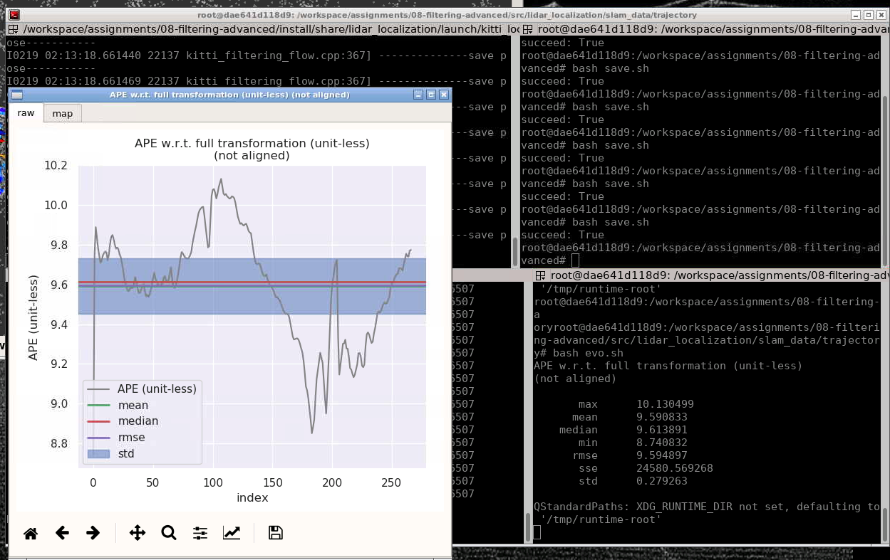

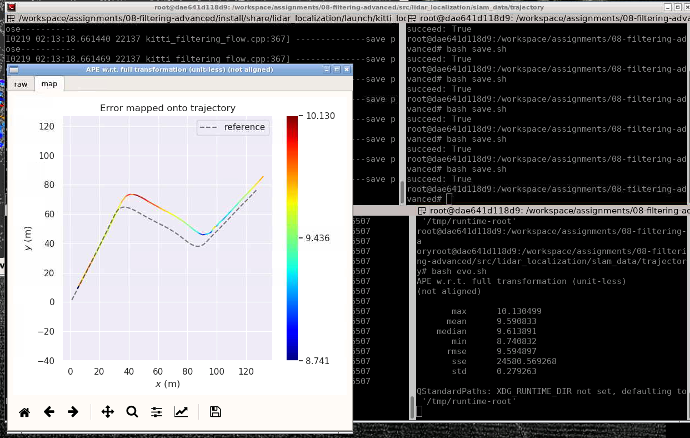

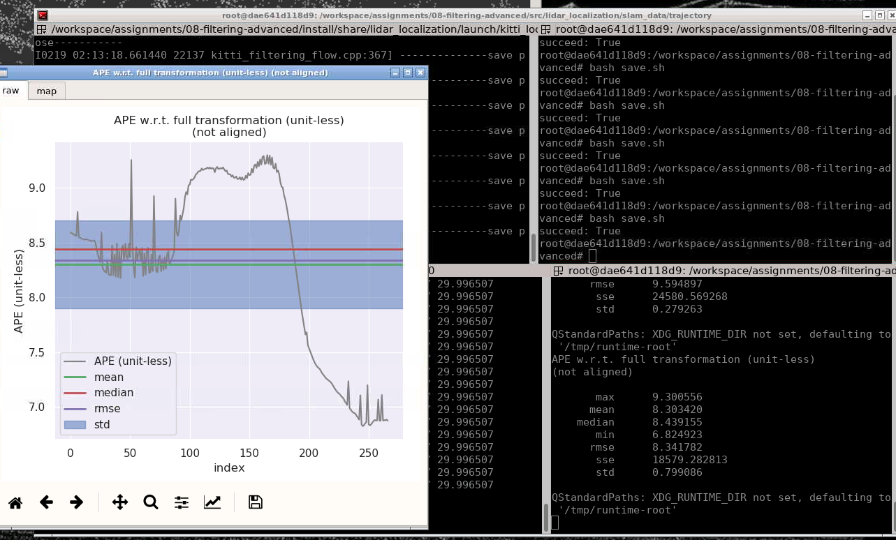

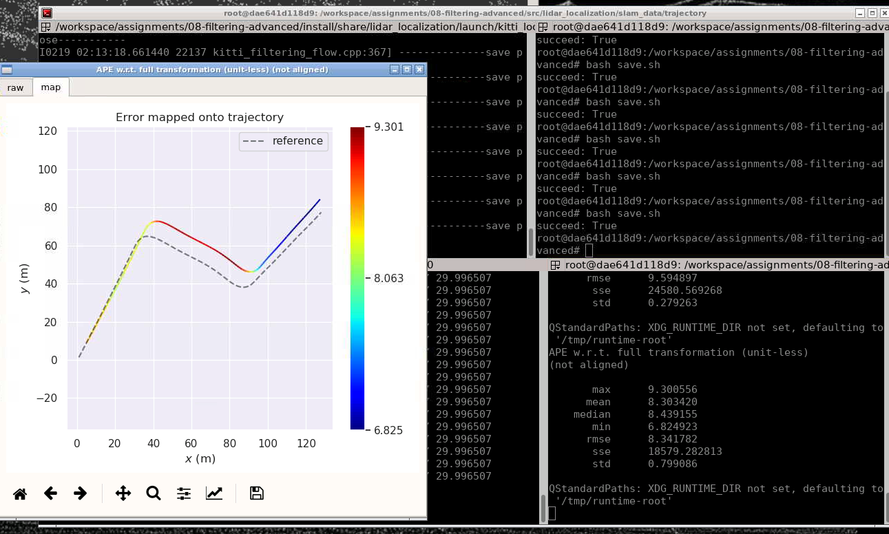

可以看出误差明显降低

# 使用模拟数据,实现以gps位置和编码器速度为观测量的融合方法,并分析精度

编译运行编译gnss_ins_sim
```bash
# build:
catkin config --install && catkin build gnss_ins_sim
# set up session:
source install/setup.bash
# launch:
roslaunch gnss_ins_sim recorder_virtual_proving_ground.launch
```
生成模拟数据，info如下：
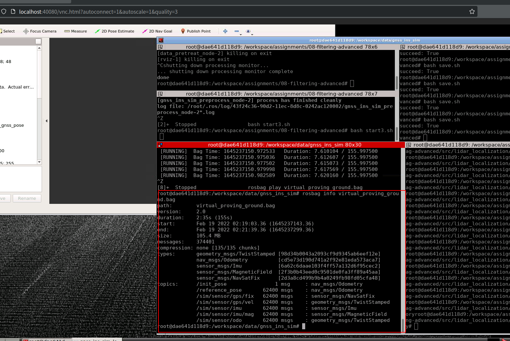

可使用**lidar_localization**, 在**GNSS-INS-Sim**上, 运行基于滤波的定位:

```bash
# launch, in upper shell:
roslaunch lidar_localization gnss_ins_sim_localization.launch
# play rosbag, in lower shell:
rosbag play virtual_proving_ground.bag
```

效果如下:
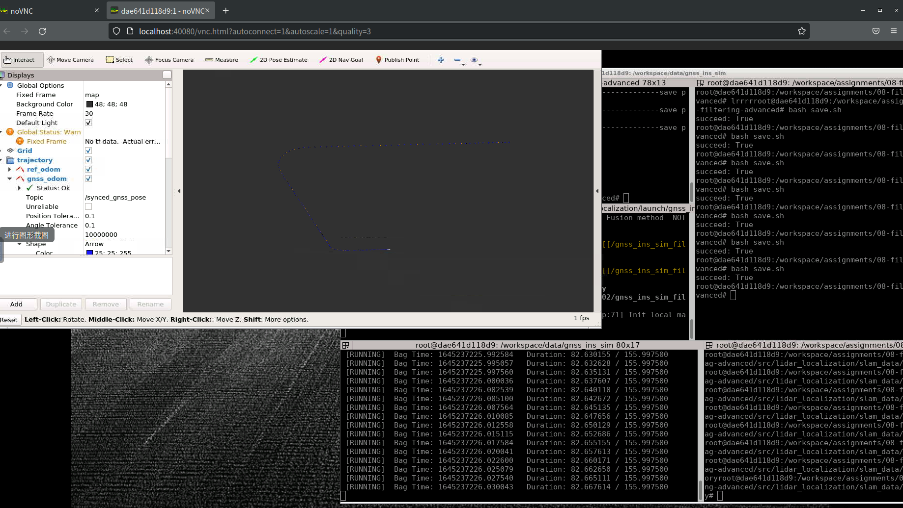

其中只用蓝色线和黄色线，没有红色线，提示

```
"Fusion method  NOT FOUND!"
```

貌似是gnss_ins_sim_filtering.yaml文件有问题，launch gnss_ins_sim_localization.launch的时候，提示找不到融合器，需要修改gnss_ins_sim_filtering.cpp 的170行(为了简单，直接删除了判断条件)

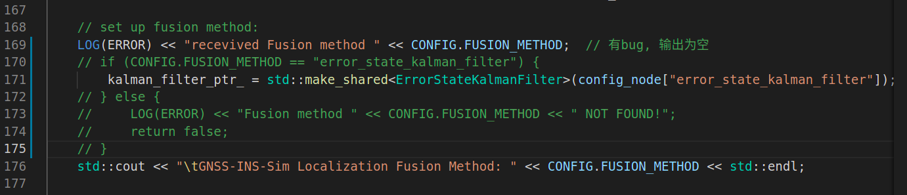


效果如下
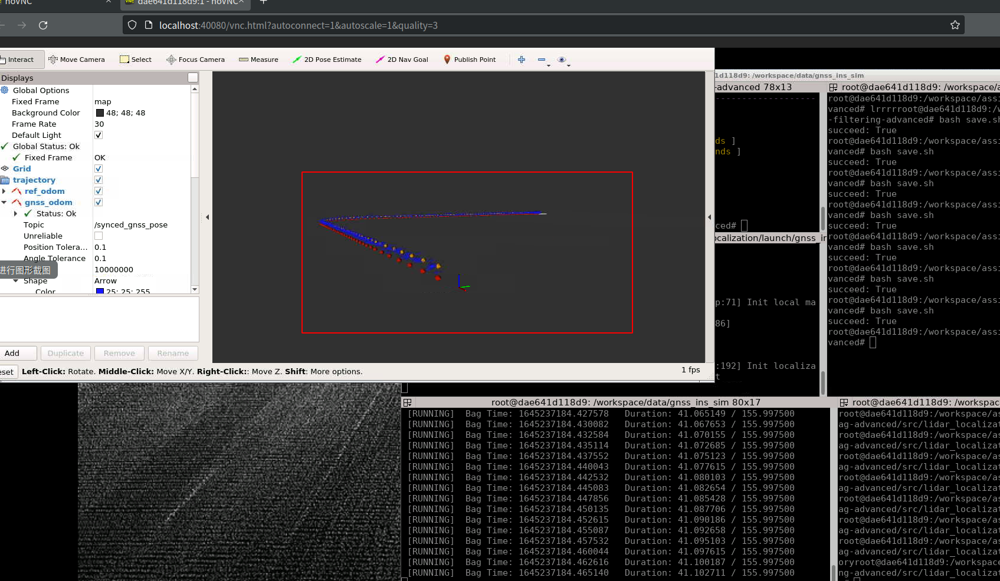

保存轨迹后，评测精度
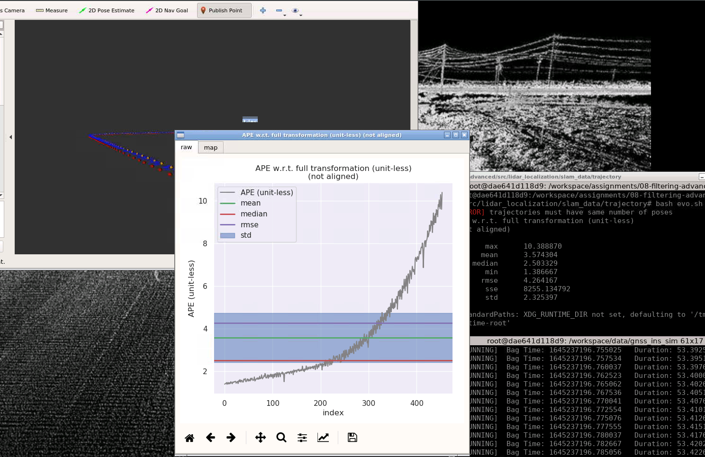
  
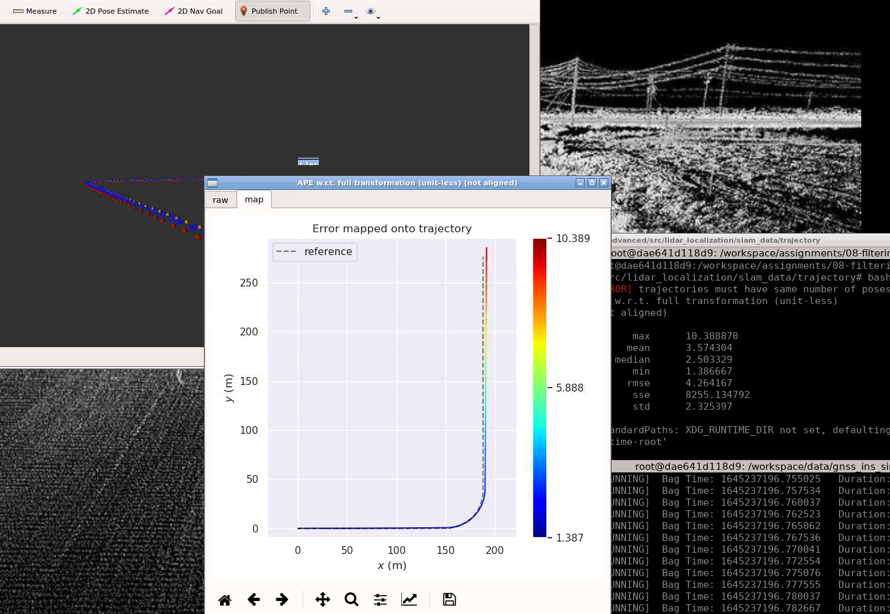
