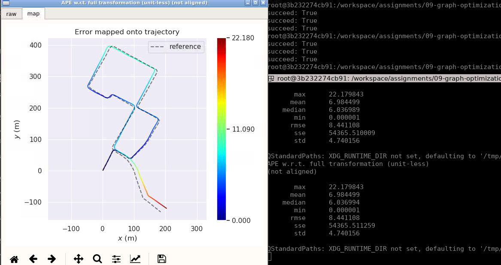
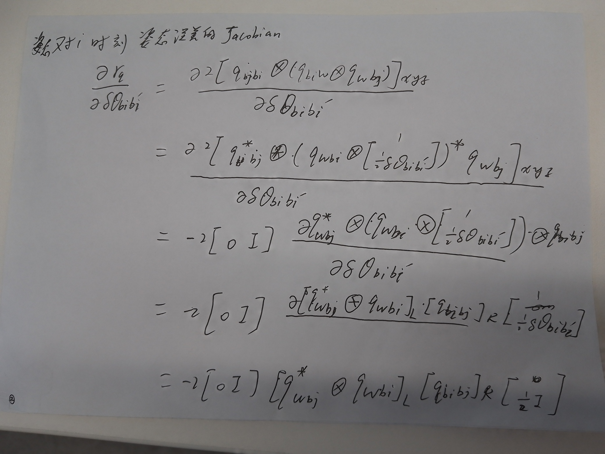

# 09-graph-optimization


Step.1 预积分 imu_pre_integrator.cpp

更新P、Q、V，需要注意此处的Q是SO3类型
```C++
// 1. get w_mid:
w_mid = 0.5 * ( prev_w + curr_w );
// 2. update relative orientation, so3:
prev_theta_ij = state.theta_ij_;
d_theta_ij = Sophus::SO3d::exp(w_mid * T);
state.theta_ij_ = state.theta_ij_ * d_theta_ij;
curr_theta_ij = state.theta_ij_;
// 3. get a_mid:
a_mid = 0.5 * ( prev_theta_ij * prev_a + curr_theta_ij * curr_a );
// 4. update relative translation:
state.alpha_ij_ += (state.beta_ij_ + 0.5 * a_mid * T) * T;
// 5. update relative velocity:
state.beta_ij_ += a_mid * T;
```
然后计算F_和B_，更新协方差和Jacobian

```C++
// 4. update P_:
MatrixF F = MatrixF::Identity() + T * F_;
MatrixB B = T * B_;

P_ = F * P_ * F.transpose() + B * Q_ * B.transpose();
J_ = F * J_;
```

Step.2 凸优化的自定义顶点， vertex_prvag.hpp

此处使用g2o，只需要将更新量增加到_estimate估计量中就行，该_estimate的类型是PRVAG()结构体  
```C++
PRVAG delta(update);
_estimate.pos += delta.pos;
_estimate.ori = delta.ori * _estimate.ori;
_estimate.vel += delta.vel;
_estimate.b_a += delta.b_a;
_estimate.b_g += delta.b_g;
 updateDeltaBiases(d_b_a_i, d_b_g_i);
```


Step.3 凸优化的自定义边，edge_prvag_imu_pre_integration.hpp
g2o中的边等于误差，其实就是ppt里的残差

```C++
const Eigen::Vector3d &alpha_ij = _measurement.block<3, 1>(INDEX_P, 0);
const Eigen::Vector3d &theta_ij = _measurement.block<3, 1>(INDEX_R, 0);
const Eigen::Vector3d  &beta_ij = _measurement.block<3, 1>(INDEX_V, 0);

_error.block<3, 1>(INDEX_P, 0) = ori_i.inverse() * (pos_j - pos_i - (vel_i - 0.50 * g_ * T_) * T_) - alpha_ij;
_error.block<3, 1>(INDEX_R, 0) = (Sophus::SO3d::exp(theta_ij).inverse()*ori_i.inverse()*ori_j).log();
_error.block<3, 1>(INDEX_V, 0) = ori_i.inverse() * (vel_j - vel_i + g_ * T_) - beta_ij;
_error.block<3, 1>(INDEX_A, 0) = b_a_j - b_a_i;
_error.block<3, 1>(INDEX_G, 0) = b_g_j - b_g_i;
```

Step.4 编译并且启动node, 本章编译有点消耗资源，笔记本可以添加-j2，使用2个CPU，避免死机
```bash
# build:
catkin config --install && catkin build -j2
```

启动node
```
# set up session:
source install/setup.bash
# launch:
roslaunch lidar_localization lio_mapping.launch
```

播放bag包
rosbag play output.bag
,效果如下图 


运行下面命令，即可保存地图、轨迹到slam_data目录下
```bash
## set up session:
source install/setup.bash
# force backend optimization:
rosservice call /optimize_map
# save optimized map:
rosservice call /save_map 
# if you still use refence Scan Context Loop Closure implementation, execute this command.
rosservice call /save_scan_context
```


在保存的轨迹txt文件中，运行下面命令
```
# run evo evaluation:
# a. laser:
evo_ape kitti ground_truth.txt laser_odom.txt -r full --plot --plot_mode xy
# b. fused:
evo_ape kitti ground_truth.txt optimized.txt -r full --plot --plot_mode xy
```


不加IMU,编译运行原始作业框架


增加IMU，重新编译运行作业框架





对比地图质量来看，左面地图(添加imu)更加精细一些，线特征分的开一些


编译器融合IMU后，只需要IMU提供角速度，IMU不提供加速度和位置增量信息了，编码器提供出位置增量。同时零偏只有IMU的陀螺仪零偏，编码器的零偏没有随机游走，所以不需要考虑：





