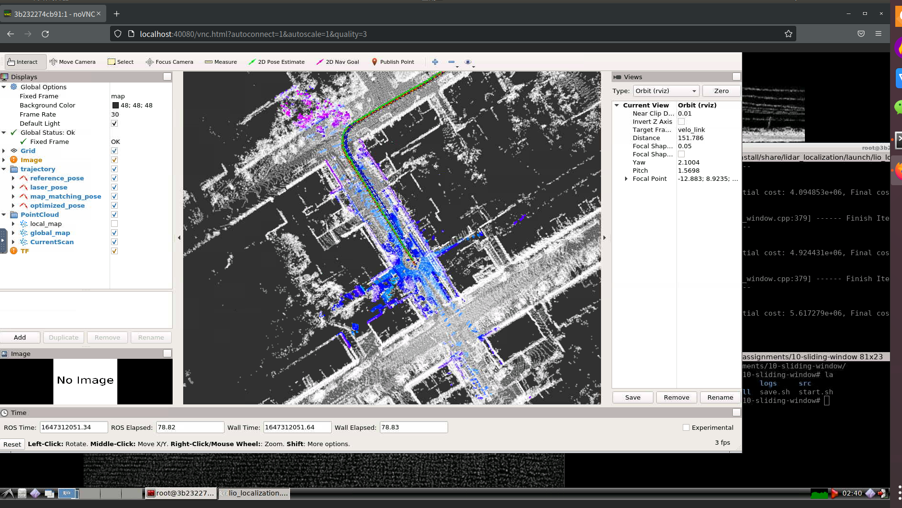

# 10-sliding -window


## Step.1 完成滑窗的factor

1、imu因子：factor_prvag_imu_pre_integration.hpp

信息矩阵计算，如下：
 
```C++
Eigen::LLT<Eigen::Matrix<double,15,15>> LowerI(I_);
// sqrt_info 为上三角阵
Eigen::Matrix<double,15,15> sqrt_info = LowerI.matrixL().transpose();
```

残差求解，如下：
```C++
const Eigen::Matrix3d oriRT_i = ori_i.inverse().matrix();
Eigen::Map<Eigen::Matrix<double, 15, 1> > resid(residuals);
resid.block<3, 1>(INDEX_P, 0) = oriRT_i * (pos_j - pos_i - vel_i * T_ + 0.5 * g_ * T_ * T_) - alpha_ij;
resid.block<3, 1>(INDEX_R, 0) = (ori_ij.inverse() * ( ori_i.inverse() * ori_j ) ).log();
resid.block<3, 1>(INDEX_V, 0) = oriRT_i * ( vel_j - vel_i + g_ * T_) - beta_ij;
resid.block<3, 1>(INDEX_A, 0) = b_a_j - b_a_i;
resid.block<3, 1>(INDEX_G, 0) = b_g_j - b_g_i;
resid = sqrt_info * resid;
```

雅克比求解，如下：

```C++
if ( jacobians ) {
    // compute shared intermediate results:
    Eigen::Map<Eigen::Matrix<double,15,15,Eigen::RowMajor>> jacobian_i(jacobians[0]);
    Eigen::Map<Eigen::Matrix<double,15,15,Eigen::RowMajor>> jacobian_j(jacobians[1]);
    jacobian_i.setZero();
    jacobian_j.setZero();

    const Eigen::Vector3d deltaR = resid.block<3, 1>(INDEX_R, 0);
    const Eigen::Matrix3d J_r_inv = JacobianRInv(deltaR);

    if ( jacobians[0] ) {
    // a. residual, position:
    jacobian_i.block<3, 3>(INDEX_P, INDEX_P) = -oriRT_i;
    jacobian_i.block<3, 3>(INDEX_P, INDEX_R) = Sophus::SO3d::hat(ori_i.inverse() * (pos_j - pos_i - vel_i * T_ + 0.50 * g_ * T_ * T_)).matrix();
    jacobian_i.block<3, 3>(INDEX_P, INDEX_V) = -oriRT_i * T_;
    jacobian_i.block<3, 3>(INDEX_P, INDEX_A) = -J_.block<3, 3>(INDEX_P,INDEX_A);
    jacobian_i.block<3, 3>(INDEX_P, INDEX_G) = -J_.block<3, 3>(INDEX_P,INDEX_G);

    // b. residual, orientation:
    jacobian_i.block<3, 3>(INDEX_R, INDEX_R) = -J_r_inv * ((ori_j.inverse() * ori_i).matrix());
    // jacobian_i.block<3, 3>(INDEX_R, INDEX_G) = -J_r_inv * (Sophus::SO3d::exp(resid.block<3, 1>(INDEX_R, 0))).matrix().inverse() * J_.block<3, 3>(INDEX_R, INDEX_G);
    // note: b_g_i - m_.block<3, 1>(INDEX_G, 0) or b_g_i
    jacobian_i.block<3, 3>(INDEX_R, INDEX_G) \
            = -J_r_inv \
            * Sophus::SO3d::exp(resid.block<3, 1>(INDEX_R, 0)).matrix().inverse() \
            * JacobianR(J_.block<3, 3>(INDEX_R, INDEX_G) * (b_g_i - m_.block<3, 1>(INDEX_G, 0))) \
            * J_.block<3, 3>(INDEX_R, INDEX_G);

    // c. residual, velocity:
    jacobian_i.block<3, 3>(INDEX_V, INDEX_R) =  Sophus::SO3d::hat(ori_i.inverse() * (vel_j - vel_i + g_ * T_));
    jacobian_i.block<3, 3>(INDEX_V, INDEX_V) = -oriRT_i;
    jacobian_i.block<3, 3>(INDEX_V, INDEX_A) = -J_.block<3, 3>(INDEX_V, INDEX_A);
    jacobian_i.block<3, 3>(INDEX_V, INDEX_G) = -J_.block<3, 3>(INDEX_V, INDEX_G);

    // d. residual, bias accel:
    jacobian_i.block<3, 3>(INDEX_A, INDEX_A) =  -Eigen::Matrix3d::Identity();
    jacobian_i.block<3, 3>(INDEX_G, INDEX_G) =  -Eigen::Matrix3d::Identity();
    }

    if ( jacobians[1] ) {
    // a. residual, position:
    jacobian_j.block<3,3>(INDEX_P,INDEX_P) = oriRT_i;
    // b. residual, orientation:
    jacobian_j.block<3,3>(INDEX_R,INDEX_R) = J_r_inv;
    // c. residual, velocity:
    jacobian_j.block<3,3>(INDEX_V,INDEX_V) = oriRT_i;
    // d. residual, bias accel:
    jacobian_j.block<3,3>(INDEX_A,INDEX_A) = Eigen::Matrix3d::Identity();
    jacobian_j.block<3,3>(INDEX_G,INDEX_G) = Eigen::Matrix3d::Identity();
    }

    //
    // TODO: correct  by square root of information matrix:
    jacobian_i = sqrt_info * jacobian_i;
    jacobian_j = sqrt_info * jacobian_j;
}
```

2、地图匹配因子 factor_prvag_map_matching_pose.hpp

信息矩阵求解
```C++
Eigen::LLT< Eigen::Matrix<double, 6, 6> > LowerI(I_);
// sqrt_info 为上三角阵
Eigen::Matrix<double, 6, 6> sqrt_info = LowerI.matrixL().transpose();
```

计算残差，如下：
```C++
Eigen::Map<Eigen::Matrix<double, 6, 1> > resid(residuals);
resid.block<3, 1>(INDEX_P, 0) = pos - pos_prior;
resid.block<3, 1>(INDEX_R, 0) = (ori * ori_prior.inverse()).log();
resid = sqrt_info * resid;
```

计算雅克比，如下：
```C++
if ( jacobians ) {
    Eigen::Map<Eigen::Matrix<double, 6, 15, Eigen::RowMajor>> jacobian_(jacobians[0]);
    jacobian_.setZero();

    const Eigen::Vector3d deltaR = resid.block<3, 1>(INDEX_R, 0);
    const Eigen::Matrix3d J_r_inv = JacobianRInv(deltaR);

    if ( jacobians[0] ) {
    // implement jacobian computing:
    jacobian_.block<3, 3>(INDEX_P, INDEX_P) = Eigen::Matrix3d::Identity();
    jacobian_.block<3, 3>(INDEX_R, INDEX_R) = J_r_inv * ori_prior.matrix();
    }
    jacobian_ = sqrt_info * jacobian_;
}
```

3、相对位姿因子 factor_prvag_relative_pose.hpp


4、边缘化因子 factor_prvag_marginalization.hpp

IMU的边缘化
```c++
void SetResIMUPreIntegration(
    const ceres::CostFunction *residual,
    const std::vector<double *> &parameter_blocks
  ) 
{
    // init:
    ResidualBlockInfo res_imu_pre_integration(residual, parameter_blocks);
    Eigen::VectorXd residuals;
    std::vector<Eigen::Matrix<double, Eigen::Dynamic, Eigen::Dynamic, Eigen::RowMajor>> jacobians;

    // compute:
    Evaluate(res_imu_pre_integration, residuals, jacobians);
    const Eigen::MatrixXd &J_m = jacobians.at(0);
    const Eigen::MatrixXd &J_r = jacobians.at(1);
    // a. H_mm:
    const Eigen::MatrixXd H_mm = J_m.transpose() * J_m;
    H_.block<15, 15>(INDEX_M, INDEX_M) += H_mm;
    // b. H_mr:
    const Eigen::MatrixXd H_mr = J_m.transpose() * J_r;
    H_.block<15, 15>(INDEX_M, INDEX_R) += H_mr;
    // c. H_rm:
    const Eigen::MatrixXd H_rm = J_r.transpose() * J_m;
    H_.block<15, 15>(INDEX_R, INDEX_M) += H_rm;
    // d. H_rr:
    const Eigen::MatrixXd H_rr = J_r.transpose() * J_r;
    H_.block<15, 15>(INDEX_R, INDEX_R) += H_rr;
    const Eigen::MatrixXd b_m = J_m.transpose() * residuals;
    b_.block<15, 1>(INDEX_M, 0) += b_m;
    const Eigen::MatrixXd b_r = J_r.transpose() * residuals;
    b_.block<15, 1>(INDEX_R, 0) += b_r;
}
```

地图匹配的边缘化
```c++
void SetResMapMatchingPose(
const ceres::CostFunction *residual,
const std::vector<double *> &parameter_blocks
) {
    // init:
    ResidualBlockInfo res_map_matching_pose(residual, parameter_blocks);
    Eigen::VectorXd residuals;
    std::vector<Eigen::Matrix<double, Eigen::Dynamic, Eigen::Dynamic, Eigen::RowMajor>> jacobians;

    // compute:
    Evaluate(res_map_matching_pose, residuals, jacobians);
    const Eigen::MatrixXd &J_m = jacobians.at(0);
    const Eigen::MatrixXd H_mm = J_m.transpose() * J_m;
    H_.block<15, 15>(INDEX_M, INDEX_M) += H_mm;

    const Eigen::MatrixXd b_m = J_m.transpose() * residuals;
    b_.block<15, 1>(INDEX_M, 0) += b_m;
}
```
相对位姿的边缘化

```c++
void SetResRelativePose(
    const ceres::CostFunction *residual,
    const std::vector<double *> &parameter_blocks
  ) 
{
    // init:
    ResidualBlockInfo res_relative_pose(residual, parameter_blocks);
    Eigen::VectorXd residuals;
    std::vector<Eigen::Matrix<double, Eigen::Dynamic, Eigen::Dynamic, Eigen::RowMajor>> jacobians;
    Evaluate(res_relative_pose, residuals, jacobians);
    const Eigen::MatrixXd &J_m = jacobians.at(0);
    const Eigen::MatrixXd &J_r = jacobians.at(1);
    const Eigen::MatrixXd H_mm = J_m.transpose() * J_m;
    H_.block<15, 15>(INDEX_M, INDEX_M) += H_mm;
    const Eigen::MatrixXd H_mr = J_m.transpose() * J_r;
    H_.block<15, 15>(INDEX_M, INDEX_R) += H_mr;
    const Eigen::MatrixXd H_rm = J_r.transpose() * J_m;
    H_.block<15, 15>(INDEX_R, INDEX_M) += H_rm;
    const Eigen::MatrixXd H_rr = J_r.transpose() * J_r;
    H_.block<15, 15>(INDEX_R, INDEX_R) += H_rr;
    const Eigen::MatrixXd b_m = J_m.transpose() * residuals;
    b_.block<15, 1>(INDEX_M, 0) += b_m;
    const Eigen::MatrixXd b_r = J_r.transpose() * residuals;
    b_.block<15, 1>(INDEX_R, 0) += b_r;
}
```

## Step.2 构建滑窗的优化问题 ceres_sliding_window.cpp

添加参数块
```c++
problem.AddParameterBlock(target_key_frame.prvag, 15, local_parameterization);
if (target_key_frame.fixed)
{
    problem.SetParameterBlockConstant(target_key_frame.prvag);
}
```

添加残差块
```c++
problem.AddResidualBlock(
                    factor_map_matching_pose,
                    NULL,
                    key_frame.prvag);
```

```c++
problem.AddResidualBlock(
                    factor_imu_pre_integration,
                    NULL,
                    key_frame_i.prvag, key_frame_j.prvag);

```

```c++

```

## Step.4 编译并且启动node

```bash
# build:
catkin config --install && catkin build -j2
```

启动node
```
# set up session:
source install/setup.bash
# launch:
roslaunch lidar_localization lio_mapping.launch
```

播放bag包
rosbag play output.bag
,效果如下图 


运行下面命令，即可保存地图、轨迹到slam_data目录下
```bash
## set up session:
source install/setup.bash
# force backend optimization:
rosservice call /optimize_map
# save optimized map:
rosservice call /save_map 
# if you still use refence Scan Context Loop Closure implementation, execute this command.
rosservice call /save_scan_context
```


在保存的轨迹txt文件中，运行下面命令
```
# run evo evaluation:
# a. laser:
evo_ape kitti ground_truth.txt laser_odom.txt -r full --plot --plot_mode xy
# b. fused:
evo_ape kitti ground_truth.txt optimized.txt -r full --plot --plot_mode xy
```


不加IMU,编译运行原始作业框架


增加IMU，重新编译运行作业框架


对比地图质量来看，左面地图(添加imu)更加精细一些，线特征分的开一些


编译器融合IMU后，只需要IMU提供角速度，IMU不提供加速度和位置增量信息了，编码器提供出位置增量。同时零偏只有IMU的陀螺仪零偏，编码器的零偏没有随机游走，所以不需要考虑：


